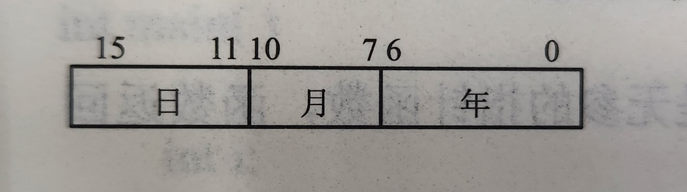

# 第二章 C语言的基本元素

## 思维导图


## 概要

本章是C语言最为基础的一章，很多知识在后续章节还会用到，如结构与联合的内容仍为基本元素，指针中也会用到类型转换等等。此外本章的内容也比其他章节更为琐碎，不易于记忆，但~~越是不好记的东西老师越爱考~~。

本章的主要内容可分为两类：数据和运算。数据包括基本元素类型、常量与变量、枚举类型（最早接触到的构造类型）；运算分为初等数学运算（加减乘除、小于大于等于）、计算机逻辑运算（或且非、赋值）、位运算（自己归纳的，不足之处请谅解）。

本章的复习我设计了三个模块：书中细碎知识、重点知识和例题（错题）。其中重点知识是结合例题来讲的，以求同时加深对两方面内容的理解。

---

## 1 边角知识

**注意**：这一部分的知识多数是老师课上所说的“这两年没考过”的知识，或课本上没有，课件上补充的知识。期末考到的概率不大，作为考试题的主题的概率则更低，酌情复习即可。

### 1.1 字符集

C语言字符集是7位ASCII码的子集，包括大小写英文字母、数字、特殊字符和<mark>空白字符</mark>（这个感觉重要一些）。

- 特殊字符 29 个，包括!、''、#、+、-、=等，主要为标点符号、数学记号。

- 空白字符包括：空格、换行符(\n)、水平制表符、垂直制表符、换页符，它们被打印出来时，页面上显示的是空白。

其他字符（如汉字）只能出现在注释语句、字符常量或字符串常量等。

### 1.2 C99新增数据类型

- long long 竞赛题、算法题用得多，64位，8byte，懂得都懂。输入输出使用%lld。

- bool类型，用得不少，只有0和非0两个值，0则为false，非0（哪怕为负数）则为true。

- 复数类型，见得不多，一般用_Complex表示实部，_Imaginary表示虚部，均为浮点型。使用复数运算和复数函数需要包含头文件<complex.h>

---

## 2 重点知识与例题分析

### 2.1 关键字与标识符

这一部分的考题通常以判断某个字符串能否作为标识符为主。<font color=red>**注意**</font>：关键字实际上是特殊的标识符，但作为考题出现时，<mark>关键字不可作为标识符</mark>

关键字共32个如下：

```c
/*************变量声明类***************/
auto
const
extern
register
static
typedef

char
double
enum
float
int
long
short
signed
struct
unsigned
union
void
/*************常用函数类*************/
break
case
continue
default
do
else
for
goto
if
return
sizeof
switch
while
/**********其他不知道干嘛的类**********/
volatile    //说明变量在程序执行中可被隐含地改变
```

#### 例1

```
（学解复习题）下列选项均不是C语言关键字的是()
A.define,IF,type
B.getc,char,printf
C.include,scanf,case
D.if,struct,type
```

<font color=blue>解析</font>：刚刚手打了一遍关键字，这下~~一眼看出答案了~~。有些程序设计时常用的字段，如 include包含头文件 , define 宏定义等并不是关键字，此外注意**大写的都不是关键字**。

本题答案选 A 。

#### 例2

```
(学解考试宝典)以下不能定义为用户标识符的是()
A._3com_
B.int
C.Void
D.STatic
```

<font color=blue>解析</font>：题很简单，这里重点说一下*用户* 标识符的定义规则：

1. 下划线或字母开头

2. 只能包含数字、下划线、字母

3. 不能是关键字

**注意**：关键字若有部分字母或全部是大写，如本题中 Void ，则可以作为标识符。

本题选B。

---

### 2.2 数据类型

一般以判断常量的类型为主，需要注意整型常量的前后缀和浮点型常量的后缀。

- 前缀：（整型常量特有）表示进制类型。0表示八进制，0x或0X表示十六进制，若小写则表示十六进制数中a~f也为小写，大写类似。

- 后缀： 表示类型。对整数，有 L / l（长整型）、 U / u （无符号）或二者结合；对浮点型：f / F （单精度）、l / L （长双精度），<mark>没有后缀时默认双精度</mark>。

- 浮点型常量可省略整数部分，默认整数部分为 0；也可省略小数部分，默认小数部分为0.

有一种特殊表示形式：科学计数法，如2E10即$2\times10^{10}$.需要注意 e / E 前面的部分不能同时缺少整数和小数，后面的部分（阶码）只能为整数。

#### 例3

```
(2015-2016期末T3)常量'1'、1、1.0的类型分别是()
A.char,int,float
B.int,char,float
C.char,int,double
D.int,char,double
```

<font color=blue>解析</font>：<font color=red>~~阴间！！~~</font>这竟是期末考试题，无语住了。对于浮点型常量，没有后缀时，默认为双精度（见上方高亮或课本P33）所以 1.0 是 double 型。

本题答案选C。

#### 例4

```
(头歌作业题改编)判断数据类型
1..12
2.'"'（一对单引号里一个双引号）
3.'''（三个单引号）
4.''（一对单引号）
5.""（一对双引号）
```

<font color=blue>解析</font>：~~依然很阴间~~。首先第一个又有题号又有小数点确实很影响辨认；后四个是同类的，需要记住：一对单（双）引号里不能有单独的单（双）引号，需要转义，一对单引号不能单独存在，但一对双引号单独存在可表示空字符串。至于为什么，~~还是去问电脑吧~~。

本题答案：浮点型常量、字符常量、非法常量、非法常量、字符串常量。

---

### 2.3 常量与变量

2.2已经判断了数据的类型，那这里常常判断数据是否合法(主要指常量)。这里值得注意的则是**常量的前缀**~~(不代表后缀不重要)~~。前缀一般包括0,0x,0b，表示了数据的进制表示法。0为八进制，0x为十六进制，0b为二进制，不能出现比自己进制数还大的数。

> 十六进制有两种前缀：0x和0X，前者表示10~15的数字时用小写字母，后者则用大写字母。如果这个错了，亲测编译器是能通过的，但课本上既然这样写~~我觉得也是非法的吧~~

科学计数法也是可能出现的内容，前面已经介绍过，学会两者之间的转换是必要的。科学计数法的表示形式为

$$
[整数部分][.][小数部分]e/E[\pm]n[后缀]
$$

这里的**省略**需要格外注意。整数和小数部分可以没有，但不能二者均无。

对于$double$常量，可以没有整数或小数其中之一，但不能缺少小数点。因为$double$类型没有后缀，所以如果只有整数部分不加小数点，如`12`，会被认为是整型。

字符常量中转义字符很重要。即使是字符串常量，如`"abcd\0"`，这里的`\0`也是一个字符而非是`\`和`0`。

常见转义字符有三种：

1. 约定俗成的字母表示，如`\n \t`

2. 三位八进制数字表示，如`\101`

3. 二位十六进制

#### 例5

```
(学解考试宝典)下面4个选项中，均是不合法的转义字符的选项是()
A.'\011','\f','\'
B.'\abc','\101','\x1f'
C.'\1011','\','\aa'
D.'\','\\','\xf'
```

<font color=blue>解析</font>：'\f'是翻页符，单独一个'\'是不合法的。十六进制转义符必须有x前缀，八进制转义符最多不超过三位。故C均不合法。

本题答案选C。

#### 例6

```
(2014-2015期末)合法的转义字符有()
A.'\45'    B.'\0'    C.'\18'    D.'\0xa'
```

<font color=blue>解析</font>：十六进制转义字符前缀是'x'。

本题答案选AB

#### 例7

```
(2013-2014期末)关于023584UL最准确的解释是()
A.无符号长整型常量    B.长整型常量
C.有符号整型常量      D.非法常量
```

<font color=blue>解析</font>：<font color=purple>不要顾此失彼</font>。注意到"UL"的后缀，我们很容易想到这可能是无符号长整型，但'0'前缀限定了该数是八进制，而常量中出现了8，因此这实际上是一个非法变量。

本题答案选D。

---

### 2.4 运算符与表达式

有了各种类型的常量和变量，下一步自然要开始运算。

需要注意的是运算符的优先级和结合性，这个一般会在附表给出，不过最好熟悉。相同优先级的表达式，从结合方向向对方方向进行运算。如右结合即从右向左运算。

| 运算符                           | 结合性 | 运算符                                | 结合性 |
| ----------------------------- | --- | ---------------------------------- | --- |
| () [] -> .                    | 左结合 | ^                                  | 左结合 |
| ! ~ ++ -- + - * & (类型) sizeof | 右结合 |                                    |     |
| * / %                         | 左结合 | &&                                 | 左结合 |
| + -                           | 左结合 |                                    | \|  |
| << >>                         | 左结合 | ?:                                 | 右结合 |
| < <= > >=                     | 左结合 | = += -= *= /= %= &= ^= \|= <<= >>= | 右结合 |
| == !=                         | 左结合 | ,                                  | 左结合 |
| &                             | 左结合 |                                    |     |

<mark>注意</mark>：从上到下，从左到右是优先级顺序，注意第二栏里 ’*‘ 是指针运算符，’+‘、’-‘ 是取正、取负运算符。

这里强调一下`序列点`的应用。对于自增和自减(专指左值，即i++而非++i)，序列点前仍用其原值，序列点后则使用新值。序列点位于：

1. &&、||、?: 和 , 运算符的第一个操作数结尾处。

2. 完整表达式的结束，包括：表达式语句的分号处，do、while、if、switch、for 语句的表达式的右括号处，for语句的两个分号处，return语句的表达式末尾分号处。

对于逗号运算符的用法，从左到右对每一个表达式运算，以最后一个逗号后的表达式作为整个表达式的值。

#### 例8

```
(2016-2017期末)设int x=3,y=2;,表达式(x++,y++)计算后，x和y的值分别是()
A.3、2    B.4、3    C.4、2    D.3、3
```

<font color=blue>解析</font>：表达式结束是序列点，因此结束后自增自减的操作已经生效。

本题答案选B。

#### 例9

```
(学解考试宝典)设变量x,y,z均为double类型且已正确赋值，下面不能正确表示数字式子
x/y/z的C语言表达式是()
A.x/y*z                B.x*(1/(y*z))
C.x/y*1/z              D.x/y/z
```

<font color=blue>解析</font>：<mark>实际上也考察了类型转换</mark>。由于x,y,z已经确定为`double`型变量，那么`1/(y*z)`这种式子就不会发生强制转化为整型(分母为浮点型)。按优先级从左至右算即可。

本题答案选A。

---

### 2.5 位运算

这是课本上加了一个`*`的章节，按照课程组组长的意思，这是非计算机学生不作要求，而计算机学生应当重点掌握的章节。

位运算主要有以下几种运算方式：

1. `按位或(|)`：存在1，则值为1，否则为0；

2. `按位与(&)`：全为1，值才为1，否则为0；

3. `按位取反(~)`：是1则0，是0则1；

4. `按位异或(^)`：不同为1，相同为0(可视作无进位二进制加法)。

5. `左移位(<<)`：高位丢弃，低位补0；

6. `右移位(>>)`：低位丢弃，高位补0或1(与机器有关)。

同时本节还有一个重要内容：**整数在机内的表示**。

- 对于无符号整数，所有位数均用来表示数据的值，而有符号整数以最高位作为符号位；

- 正数在机内是以原码表示的，负数在机内是以补码表示的

- `原码`就是高位符号位，低位二进制表示其绝对值；符号位除外其他位取反则为`反码`；反码加一即为`补码`。

#### 例10

```c
(2019-2020期末)改错题
将p的高字节作为低字节，q的低字节作为高字节组成一个新的短整型数k
#include<stdio.h>
int main(){
    short p=0x8034,q=0x5678;
    k=p>>8|q<<8;
    printf("%hx\n",k);
    return 0;
}
```

<font color=blue>解析</font>：对于数的右移位，为防止机器原因造成高位补1带来的影响，可以让p右移八位后的结果与`0xFF`取与，再与q取或。

正确答案：`k=p>>8&0xFF|q<<8`。

#### 例11

```
(2019-2020期末)写一个表达式，将表示21世纪日期的日(day)、月(month)和年(year)
三个整数(如19年12月24日)压缩存储在一个短整型数x中，存储格式如下图所示：
```



<font color=blue>解析</font>：压缩的方式不只是字段结构，<mark>位运算</mark>也可以起到压缩的作用。我们只需要让日、月左移位到高位即可。

正确答案：`x=day<<11|month<<7|year`。

其实无论字段结构还是位运算，都是将其他数存储在另一个数空余的二进制位上。

#### 例12

```
(2015-2016期末)表达式1|2|4>>2的值是()
A.0    B.1    C.3    D.4
```

<font color=blue>解析</font>：看上去考位运算，实际上考优先级。按位或的优先级高于右移位，因此从左至右顺序计算即可。

本题答案选B。

---

#### 2.6 类型转换

按照课程组组长的意思，类型转换只需注意“高位溢出”即可，但这里想把类型转换的一般过程梳理一下。

1. 整数提升：对于`char`和`short`，首先会引起整数提升，自动转换成`int`或`unsigned`

2. 算术转换：对于双目运算符的求值，首先两个操作数独立整数提升，若提升后两个操作数类型不同，就会发生算术转换，总原则为：值域较窄的类型向值域较宽的类型转换，这里值域指能表示值得最大范围。
   
   ```
   char/short -> int -> unsigned -> long -> unsigned long -> long long 
   -> unsigned long long -> float -> double -> long double
   ```

3. 赋值转换：右操作数的值被转换为左操作数的类型。

4. 强制类型转换：实际上是一个运算符，在前面优先级表上可查。

<font color=red>注意</font>：浮点数转换为整数时，截去小数部位，不存在四舍五入等运算规律。

```
没有错题
```

---

#### 2.7 枚举类型

主要注意枚举类型的定义和使用。

```c
enum[枚举名]{标识符[=常量表达式],标识符[=常量表达式],...}
```

如`enum weekday{SUN,MON,TUE,WED,THU,FRI,SAT};`

枚举类型内部的标识符实际上是枚举常量，如果没有特殊赋值，则从0开始按1递增，若其中一个常量赋值为k，则下面的常量从k开始按1递增。

```
没有错题
```

---

<font color=yellow>END</font>
