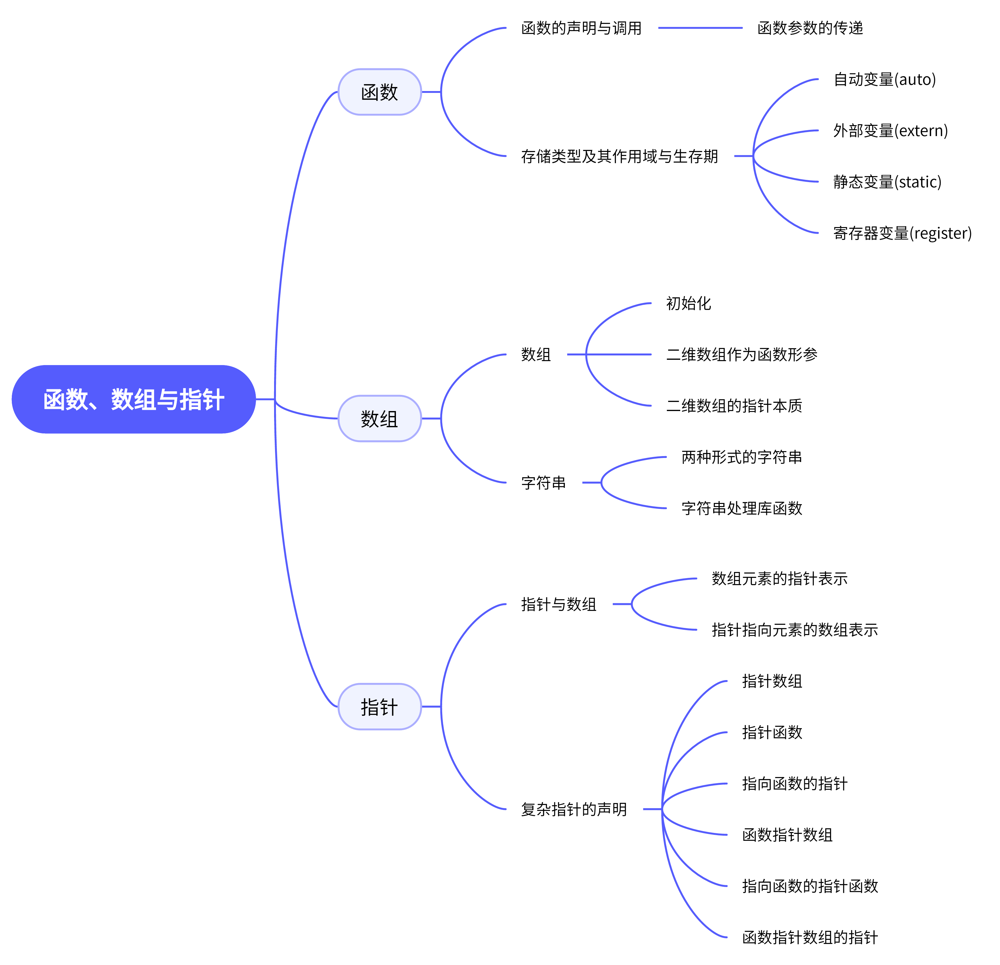

# 函数、数组与指针

## 思维导图



## 概述

函数是贯穿C语言后半部分的一章，很多功能的实现依托于函数。正因此函数本身处于一个**很重要但又无需重点复习**的章节，正如流程控制一样，其存在只是为了实现一种功能。而在函数章节需要重点复习的，实际上是四种变量的存储类型和作用域与生存期(与课程组老师不谋而合)。这里也会把函数与带参宏定义进行比较。

数组是连接C语言上下部分的一章，数组本身作为储存变量的容器，其性质与它存储的变量类型的性质一致。需要注意的是二维数组作为**函数形参**的表示方式以及**字符串**的相关处理。同时也可以思考一下数组的指针本质。

指针则是C语言集大成的一章，也是课程的最大重难点。课程组老师说过

> 指针搞不好，考过很难

大概就是这个意思。这一章需要复习的就太多了。各种指针的声明及实际作用都需要熟练掌握，但最重要的是明白每个指针的类型和它所指向的对象。

## 1 边角知识

**注意**：这一部分的知识多数是老师课上所说的“这两年没考过”的知识，或课本上没有，课件上补充的知识，但不包括老师说的“完全不考”的知识。期末考到的概率不大，作为考试题的主题的概率则更低，酌情复习即可。

如果复习尚未完成，建议先看第二部分，再看这里的边角知识。

### 1.1 条件编译与断言

是编写程序进行调试时常用到的语句。主要有以下几组：

1. #if 指令
   
   #if 常量表达式 程序段
   
   #elif 常量表达式 程序段
   
   #else 程序段
   
   #endif
   
   当常量表达式不为0时执行对应的程序段，用法类似if函数，但容易添加和删除，适合调试时使用。

2. #ifdef 指令
   
   #ifdef/#ifndef 标识符 程序段
   
   #elif 常量表达式 程序段
   
   #else 程序段
   
   #endif
   
   ifdef(或ifndef)用于检测标识符是否被(或未被)#define宏定义。
   
   也可用`#if defined(标识符)`

3. 断言assert
   
   `assert(condition)`若condition为真，则什么也不发生，否则程序终止运行。

## 1.2 指针变量的大小

任意类型的指针变量均占用4个字节(32位系统)或8个字节(64位系统)

### 1.3 typedef

能看懂即可。typedef定义的一般形式为：

```clike
typedef 类型区分符 说明符;
```

例如：`typedef int bool`，即`bool`是基于`int`的一个分支，定义了新的类型名

`typedef char * string`，给`char *`一个别名`string`。

---

## 2 重点知识与例题分析

### 2.1 函数的声明与调用

函数声明的形式为

```c
类型名 函数名(参数类型 [标识符],参数类型 [标识符],...);
```

函数调用时参数的传递方式为值传递，区别于`引用传递`。前者只传值，后者传递的是地址。

#### 例1

```c
(同学问的题)实现交换x,y的值的功能，下面函数是否正确
1.调用：swap(&x,&y);
  声明：void swap(int *x,int *y);
2.调用：swap(x,y);
  声明：void swap(int &x,int &y);
函数体均为：
{
    int t;t=x;x=y;y=t;
}
```

<font color=blue>解析</font>：函数的参数形式与其**调用形式**有关。但无论什么形式，只要注意到函数的值传递，能做到改变的是数本身(原地址上的数)而非传递的数即可。

`int *x=&a`好理解，做到了传地址，`int &a=b`实际上是在C++里学的引用声明，a改变，则b也相应改变。

故两个函数都是能实现传递功能的。

---

### 2.2 存储类型及其作用域与生存期

四种变量存储类型分别为：自动变量`auto`，外部变量`extern`，静态变量`static`，寄存器变量`register`。

1. 自动变量是最常使用的量，函数内部的声明允许省略关键字auto。其作用域为**块范围**，局限于定义它的代码块，退出块时变量的值就丢失了。重新进入块时编译器会为变量再次分配空间，但原先的值已经没有了。

2. 外部变量在函数外定义，定义时**不能**使用关键字extern，只是在引用时加上extern。它的作用域是文件范围，从定义处开始到源文件结束。若想引用其他文件的或定义点前的外部变量，需要加上extern。

3. 静态变量可以是全局变量，也可以是局部变量。静态变量和外部变量一样放在静态数据区生存期与其相同，但作用域不同。静态变量的作用域是块作用域，但程序执行期间它的值不会消失，有记忆性，再次进入块时，依然是原先的值。如果它在块中被定义，那么只做一次赋初值，再次进入块时不再赋初值，沿用上次在块中最后的计算值。

4. 寄存器变量只能用于定义局部变量，存储在寄存器中，提高执行速度，其余特性等同于自动变量。

#### 例2

```c
(2019-2020期末)程序改错
函数fac_sum计算并返回1!+2!+...+n!。例如，第一次调用fac_sum(4)返回33，第二次调用
fac_sum(3)返回9.
unsigned long fac_sum(int n){
    static unsigned long s=0,f=1;
    int i=1;
    do{
        f*=++i;
        s+=f;
    }while(i<=n);
    return s;
}
```

<font color=blue>解析</font>：实际考察存储类型。程序中do-while是在f、i初值为1，s初值为0时可实现阶乘之和。但是静态变量static使得函数返回后 s、f 的值仍为上次的计算结果，再次进入时不会再被赋初值，影响了函数功能的实现。

正确答案：`unsigned long long s=0,f=1`。

本题也可能改编成写程序运行结果题，要注意避免想当然，无论如何按照计算机执行顺序读一遍。

---

### 2.3 二维数组及其应用

二维数组实质上等价于指向数组的指针而非二级指针。其数组名首先是首行地址，其次才可看做首元素地址。

二维数组的逻辑结构是具有行和列的二维数据分布，类似于矩阵，两个下标可以看作是它们的坐标。而其存储结构是一维的，先存储首行元素，紧接着存储第二行、第三行……所以二维数组的任意值可以使用一级指针来访问。

二维数组作为函数的形参时，正确的声明形式如下：

```c
数据类型名 数组名[][整型常量表达式]
```

即列数不可省略。

如果使用const、static、extern对数组进行定义或声明，那么数组中的**每一个元素**都具有这些储存类型的性质。

数组在进行初始化时，如果整体未赋初值，那么每个元素的具体值不可知，如果只对某些元素赋值，那么其余值为0。初始化赋值时也可以空缺特定的数，空缺的数为0。对于二维数组，第一维下标可以省略，<mark>第二维下标不能省略</mark>。

#### 例3

```
(2016-2017期末)对二维整型数组A的部分元素初始化的形式有()
A.int A[2][3]={{,2,3},{4,6}}    B.int A[2][3]={1,2,3,4}
C.int A[][]={{1,2},{4,5}}       D.int A[][3]={{1,2,3},{4,5}}
```

<font color=blue>解析</font>：二维数组初始化可以缺行，但不能缺列，故C错误。数组初始化时，缺失元素不能位于初值列表的前面或中间，只能在最后，即只有后面的可以省略，A错误

本题答案选BD。

#### 例4

```
(学解考试宝典)若有说明：int a[][4]={1,2,3,4,5,6,7,8,9,10,11,12};则数组第一维
的大小为()
A.2        B.3        C.4        D.不能确定的值
```

<font color=blue>解析</font>：当第一维下标缺失时，正如一维数组的下标缺失，系统会根据你的初值列表确定你的数组大小。这里一共有12个元素，列数为4，故行数自然为3。

本题答案选B。

---

#### 2.4 字符串操作

字符串是最常见的数据结构之一。字符串的实现方式有两种，字符数组或指针形式。对指针形式的字符串，赋初值后就不能再修改，如

```c
char *s="aaaa";
s[0]='b';
```

这是不合法的。

对于字符数组定义的字符串，注意字符串的末尾有一位`\0`，确保不会发生越界。

"string.h"里有许多字符串处理库函数，要明白每个函数是什么意思。

```c
int strlen(char *s);/*求字符串s的长度，不包括'\0'*/
char *strcat(char *s,const char *t);
//字符串连接，把t放到s的结尾并返回s的地址
int strcmp(const char *s1,const char *s2);
//字符串比较，字符串相同则返回0，若s1的ASCII码大于s2，则返回大于零的值
//否则返回值小于0
char *strcpy(char *t,const char *s);
//字符串复制，将字符串t的内容复制给字符串s，并返回s的地址
char *strstr(const char *s,const char *t);
//查找子串，s中若有t出现，则返回t在s中第一次出现的位置，否则返回NULL
```

还有一些平常写程序时可能会用到的好用的函数，在"stdlib.h"里。

```c
char *itoa(int iv,char nstr[],int radix);
//将iv的值转化为字符串，进制是radix
char *ltoa(long iv,char nstr[],int radix);
//只是把int变成了long
int atoi(const char nstr[]);
//把字符串nstr转化为整型数，函数返回转换后的值
int atol...//同理
double atof(const char nstr[]);
//把字符串nstr转化为双精度浮点数
```

#### 例5

```c
(学解考试宝典)下列程序运行的结果为()
#include<stdio.h>
#include<string.h>
main(){
    int i;
    char a[]="How are you!";
    for(i=0;a[i];i++)
        if(a[i]==' ')
            strcpy(a,&a[i+1]);
    printf("%s\n",a);
}
A.are you!    B.Howareyou!    C.areyou!    D.you!
```

<font color=blue>解析</font>：<font color=red>程序运行结果题避免想当然！</font>如果不认真读，很可能以为这个主函数是遇到空格就把后面的字符串取代整个字符串，就会理所当然地选D。但注意，当程序运行到第一次发现空格时，i=3，这是将"are you!"赋给a，继续循环，此时i=4，a[i]='y'，后面没有空格，于是"are you!"就是最终结果。

#### 例6

```
(学解考试宝典)若有以下说明语句，则输出结果是()
    char sp[]="\t\b\0123\n";
    printf("%d",strlen(sp));
A.11        B.7        C.6        D.5
```

<font color=blue>解析</font>：~~还得是学解啊~~。'\t','\b','\n'都好理解，是三个转义字符。八进制转义字符最多有三位，故'\0123'肯定不是一个转义字符。由于转义字符的最大匹配机制，1,2均未超出八进制数字范围，故取到三位，即'\012'是一个字符，'3'是一个字符。

如果是"\0183"，那么'\01'是一个字符，'8','3'各是一个字符。

本题答案选D。

---

### 2.5 指针与数组

一级指针可以模拟一维数组。而虽说二维数组是指向数组的指针，但依然可以用指针数组、二级指针去模拟二维数组。

#### 例7

```
(2019-2020期末)已知int a[5][3],表达式a和a[0]有何异同？写一个表达式用于计算
二维数组a的行数。
```

<font color=blue>解析</font>：对于二维数组，a和a[0]都是二维数组的首行，实际上也都是数组首元素的地址，但作为指针，a指向一个包含三个元素的数组，而a[0]指向这个数组的第一个元素(一维数组的数组名是首元素的地址)。

计算行数：`sizeof(a)/sizeof(a[0])`。

#### 例8

```
(2014-2015期末)设有声明：int a[2][3]={{1,2,3},{4,5,6}},*p=&a[0][0];则表达式
的值为5的选项有()
A.*(a[1]+1)    B.*(p+4)    C.*(a+1)[1]    D.p[1][1]
```

<font color=blue>解析</font>：<font color=cyan>顾此失彼是大忌</font>。A、B都好理解。对于C，由于[]的优先级高于*，因此该表达式计算顺序是`*((a+1)[1])`，指到了a逻辑上的的第3行。而p作为一级指针，没有这种用法。

作为对照，如下程序段：

```c
#include<stdio.h>

int main(){
    int a[3][3]={{1,2,3},{4,5,6},{7,8,9}};
    int (*p)[3]=a;
    //int **p=a;运行错误
    printf("%d %d %d",*(a+1)[1],(*(a+1))[1],p[1][1]);
    return 0;
}
```

运行结果为`7 5 5`。

本题答案选AB。

---

### 2.6 复杂指针声明

这里介绍除了指向基本类型的一级、二级指针外的其他所有形式的指针。

1. 指针数组
   
   `类型区分符 *数组名 [常量表达式]`，如`int *p[3]`。
   
   这句话的意思是定义一个具有三个元素的数组，数组元素的类型为整型指针。
   
   指针数组可以用来模拟二维数组、字符串数组。

2. 指针函数
   
   `类型区分符 *函数名(形参表)`，如`int *pfun(int,int)`。
   
   这句话的意思是声明一个函数，函数的参数为两个`int`型，返回值的类型为`int *`。
   
   最大的特点是返回指针。

3. 指向函数的指针
   
   `类型区分符 (*标识符)(形参表)`，如`int (*comp)(char *,char *)`。
   
   这句话的意思是定义一个指向函数的指针，该指针指向的函数有两个`char *`类型的参数，返回值是`int`型。
   
   主要用于**散转程序**，实际上往往是以指向函数的指针数组形式出现。

4. 指向数组的指针
   
   已经提过多次，是二维数组的指针本质。
   
   `类型区分符 (*标识符)[常量表达式]`，如`int (*p)[3]`。
   
   这句话的意思是，定义一个指向数组的指针，该指针指向的数组是有三个元素的一维数组，元素的类型是`int`型。
   
   主要用于模拟二维数组。

5. 函数指针数组(指向函数的指针数组)
   
   `类型区分符 (*标识符[常量表达式])(参数列表)`，如`char *(*pf[3])(char *p)`。
   
   这句话的意思是，定义一个有三个元素的数组，数组的元素类型为指针，这些指针指向以`char *p`为参数，返回值为`char *`的函数。
   
   用于散转程序

6. 指向函数的指针函数
   
   ~~开始阴间起来了。~~
   
   `类型区分符 (*标识符(参数列表))(参数列表)`，如`int (*f(int))(int *,int)`。
   
   这句话的意思是，声明一个函数，该函数以一个`int`为参数，返回值为**指向函数的指针**，该指针指向以一个`int *`，一个`int`类型为参数，返回值为int的函数。

7. 函数指针数组的指针
   
   `类型区分符 (*(*标识符)[常量表达式])(参数列表)`，如`char *(*(*pf)[3])(char *p)`
   
   这句话的意思是，定义一个指针，该指针指向具有三个元素的数组，元素类型为指向函数的指针，这些指针分别指向一个以`char *p`为参数，返回值为`char *`的函数。

判断方法：

1. 首先判断声明/定义的是函数还是指针，如果指针后面紧跟参数列表，则是函数声明。
   
   如果是指针，判断是不是指针数组，如果指针后面直接跟`[常量表达式]`，则是定义了一个指针数组。

2. 然后看指向的是函数还是数组，如果指针加上括号后紧跟的是参数列表，则指向的是函数，然后找参数和返回值；如果紧跟的是`[常量表达式]`，则指向数组，然后找数组的元素类型。

3. 对于指向函数的指针，对其返回值重新判断；对于指向数组的指针，对其元素类型重新判断。

掌握这些例子和方法，判断或写出指针声明就会变得相对有迹可循。

#### 例9

```
(2015-2016期末)有声明int *(*p[10])(void)，写出p的完整含义。
```

<font color=blue>解析</font>：首先看指针后面，未紧跟参数列表，而是紧跟中括号常量，故这实质上是声明指针，而且是指针数组。再来看它的指向，后面跟的是`(void)`，故它们指向的是函数。

最终确定答案：定义一个具有10个元素的数组p，数组中元素的类型是指针，这些指针分别指向一个以`void`为参数，返回值为`int *`的函数。

---

### 2.7 不同型指针移动

我们已知指针的移动是因其类型不同而变化的，对于同一个`p+1`，如果指针类型为`char *`型，那么它移动一个字节；如果指针类型为`int *`，那么它移动四个字节。

在实际应用中，并不总是用指针指向与它类型相同的元素，例如我们可以用`char *`型指针指向`int`元素，起到取出它的每一个字节的作用。

#### 例10

```c
(2015-2016期末)设有声明：
int a=0x12345678,*pa=&a;
unsigned char *pc=(unsigned char *)pa;
则表达式*(pc+2)的值是()
A.0x12    B.0x34    C.0x56    D.0x78
```

<font color=blue>解析</font>：不得不说到<mark>高位优先与低位优先</mark>的问题。

> 大多数计算机按高位优先顺序存储32位的数，但基于Intel CPU的计算机按低位优先顺序存储32位的数。[来源](https://blog.csdn.net/sweetfather/article/details/79781521)

~~然而我高贵的AMD锐龙5800也是低位优先~~。

也就是说，对于相同的数据，比如`short a=1`，

高位优先：`00000000 00000001`

低位优先：`00000001 00000000`

<font color=red>注意</font>：高低位以八位(一个字节)为界。

那么这一题就不用多说了，pc向右移动两个`char *`的空间，也就是`0x34`。

---

<font color=yellow>END</font>
