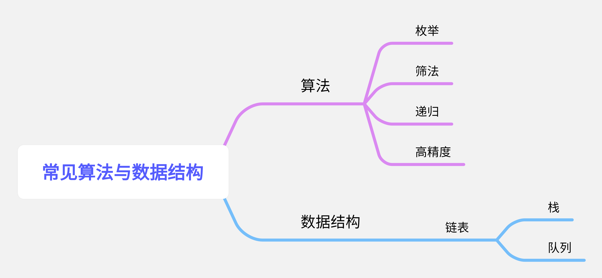

# 常见算法

## 思维导图



## 概述

在涉及流程控制、数组、指针、结构等知识时，课本上讲解了一些常见的算法和数据结构，这些算法虽然不要求必须会写出其实现过程，但在期末考试中往往会出现利用这些算法写表达式、完善程序等题目。例如递归函数的实现，筛法的数学思想。因此我们应熟悉算法实现的原理，至少熟悉课本上算法出现的实例。

## 1 算法

### 1.1 枚举

又名暴力，是常用的搜索算法之一，也是搜索算法中写起来最简单，效率最低的一种。这个没什么好说的，从头到尾遍历即可。

#### 例1

```
(课本4.7.2)高中一年级某班有4位学生，其中的一位做了好事不留名，表扬信来了之后，校长
问这4位学生谁做了好事？4位学生的回答如下。
(1)A说：不是我。
(2)B说：是C。
(3)C说：是D。
(4)D说：他胡说。
已知三位学生说的是真话，一位学生说的是假话。现在要根据这些信息，通过编写程序找出做了
好事的人。
```

<font color=blue>解析</font>：我们可以假设其中一个人做了好事，如果有三句话与之相符，一句话与之不符则假设成立。

```c
#include<stdio.h>
int main(){
    char Thisman;
    for( Thisman='A' ; Thisman<='D' ; Thisman++ ){
        if((Thisman!=A)&&(Thisman=='B')&&(Thisman=='D')&&(Thisman!='D')==3){
            printf("%c\n",Thisman);
            break;
        }
    }
    return 0;
}
```

### 1.2 筛法

用于判断质数。利用一个数的整数倍一定不是质数的原理，先生成一个质数表，然后进行查表即可得到该数是不是质数。

```c
#include<stdio.h>

int main(){
    int i,j;       //循环变量
    int a[100];    //质数判断数组
    for(int i=0 ; i<100 ; i++)
        a[i]=1;    //默认是质数
    for(a[0]=a[1]=0,i=2; i<50 ; i++ ){
        for(j=i*i ; j<100 ; j+=i)
            a[j]=0;
    }
    return 0;
}
```

### 1.3 冒泡排序

$O(n^2)$的排序算法，按轮进行，每次找到剩余元素的最大/最小值，移动到符合要求的一端。

```c
void BubbleSort(int a[],int n){
    int i,t,j;    //循环变量
    for( i=0 ; i<n-1 ; i++ )
        for( j=0 ; j<n-i-1 ; j++ )    //数据范围从0~n-i-1
            if(a[j]>a[j+1]){          //最大值移到当前范围最高位
                t=a[j];
                a[j]=a[j+1];
                a[j+1]=t;
            }
    return ;
}
```

### 1.4 二分查找

对有序数组的操作，如果无序应先进行排序。

> 题外话：事实上，如果无序，就不要用二分查找了，快速排序的复杂度都已经是$O(NlogN)$，顺序查找的复杂度才$O(N)$，属实是得不偿失。

首先找到中间元素的下标`mid=(left+right)/2`(最初`left=0,right=n-1`)。如果`a[mid]`大于我们要找的值，就让`right=mid-1`；小于我们要找的值，则`left=mid+1`，知道找到所求值，返回`mid`即可。如果`left>right`时依然没有找到，则没有这个元素，返回`-1`。

```c
int BinarySearch(int a[],int val,int n){    //n是数组元素个数
    int left=0,right=n-1,mid=(left+right)/2;
    while(left<=right){
        if(a[mid]==val)
            return mid;
        if(a[mid]>val){
            right=mid-1;
            continue;
        }
        if(a[mid]<val){
            left=mid+1;
            continue;
        }
    }
    return -1;
}
```

### 1.5 递归

函数直接或间接调用自己的算法称为递归。当参数为某个值时，函数必须返回而且返回类型为函数的类型，这个返回值有该问题最本质的特征。这就是递归函数的**返回条件**。

课本以经典的*汉诺塔问题* 作为递归函数的例题。即有A、B、C木桩，A上有大小不等的圆盘，大盘在下，小盘在上，需要借助木桩B将其移动到木桩C上，且不允许出现大盘放在小盘上面的情况。

```c
void move(int n,int a,int b,int c){    //a,b,c存储木桩名，最初为'A''B''C'
    static int cnt=1;        //记录移动步骤数
    if(n==1)
        printf("step%d:%c-->%c\n",cnt++,a,c);    //从a移动到c
    else{
        move(n-1,a,c,b);     //把n-1个盘子从a借助c移动到b
        printf("step%d:%c-->%c\n",cnt++,a,c);    //a剩下的盘子移到c
        move(n-1,b,a,c);     //把刚移到b的n-1个盘子借助a移到c
    }
    return ;
}
```

#### 例2

```c
(2020-2021期末节选)下面函数的功能为计算链表的长度，完善程序
/*有关链表结构体的定义
typedef struct str_node{
    char ch;
    struct str_node *next;
}TLONG_STR,*PLONG_STR;
*/
int long_str_len(PLONG_STR first)
{
    if(first==NULL)
        return 0;
    return 1+________________;
}
```

<font color=blue>解析</font>：看到`return`语句的复杂结构，首先想到是否会用到递归，返回函数执行结果。当first是空指针时返回0，那么链表的长度就应当是1+以下一个结点为开头的链表长度。

本题答案为`long_str_len(first->next)`。

<font color=red>需要注意的是</font>，考试里不会告诉你函数的功能，需要你根据调用前后的情况、函数内容和函数名来判断函数功能。

### 1.6 高精度加法

主要用于十五位以上有理数的加法。有一个被加数、一个加数、一个和数组，用于储存数字的各个位数。计算时应从低位开始，进行带进位的加法。课本上使用了指针来进行读取和相加的操作，这里只展示相加的操作。以下为课本源代码。

```c
void addBigNum(int *z,int *x,int *y){    //x,y是加数数组，已读入，z是和数组
    int i,carry,n;       //carry是进位数
    for(i=1;i<=N;i++)
        *(z+i)=0;
    n=max(*x,*y);        //课本上说n表示x、y较长的位数，不能理解
    for(carry=0,i=1;i<=n;i++){
        *(z+i)=*(x+i)+*(y+i)+carry;
        carry=*(z+i)/10;
        *(z+i)%=10;
    }
    if(carry)
    {
        *(z+i)=carry;
        i++;
    }
    *z=i-1;        //这是在干嘛？
}
```

总之课本上的内容有很多我不理解的地方。此外课本说高精度计算是基于分治法，我也没看出来。

---

<font color=Yellow>END</font>
