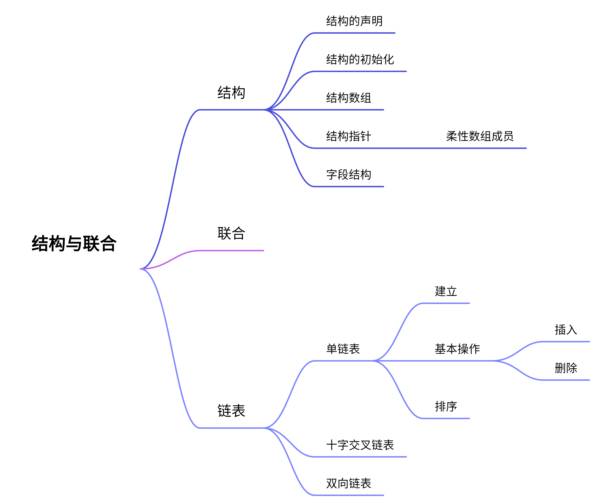

# 结构与联合

## 思维导图



## 概述

结构与联合是同指针一样的C语言集大成的章节。首先作为一种构造类型，结构与联合体的内部元素大部分是第二章接触到的基本类型(也可能是第八章的指针)，那么这些内部元素**相对独立**地拥有自己原有的特性。而作为整体，结构自身有其特有的意义，同时也有“结构数组”、“结构指针”这些类型。这些特性使得结构体成为实现`链表`的最佳方式之一，而链表也是许多`数据结构`的实现方式。因此结构是综合运用C语言所学的，为其他课程做铺垫的重要一章。

---

## 1 边角知识

### 1.1 柔性数组成员

C99新增功能，支持动态结构类型，结构中最后一个成员可以是不给出为大小的数组，这种数组成员在标准中称为柔性数组成员。如：

```c
struct stud{
    char name[20];
    int score[];
}
```

但是这种结构的空间不包含柔性数组的空间，即如果要使用数组`score`，需要用`malloc`为其分配空间。如：

```c
struct stud *p;
p=(struct stud *)malloc(sizeof(struct stud)+3*sizeof(int))
//如果数组的大小是3的话
```

---

## 2 重点知识与例题分析

### 2.1 结构的定义与初始化

结构和数组一样，都是一种构造类型，但结构内数据的类型可以不同。结构声明的一般形式为：

```c
struct 结构类型名{
    成员声明表
}[标识符列表];
```

我们同样可以在结构声明时进行初始化，如：

```c
struct planet{
    char name[10];
    double diameter;
    int moons;
} x={"Jupiter",142987,79};
```

这样的初始化是顺序的，分别表示x的name、diameter、moons。

结构也可以嵌套，这里不展开举例。

结构也可构造为数组，称为结构数组。结构数组的初始化在形式上与二维数组类似，如：

```c
struct stud students[]{
    {"20160805001","Zhang",'m',{5,6,1998},0};
    {"20160805002","Li",'f',{8,20,1998},0};
}
```

与二维数组的初始化一样用到了双层花括号(最内层包含三个数字的花括号是因为`stud`结构体中含有结构类型的元素)，也与二维数组一样，内层的括号可以不写出来，只是方便辨认。

```
没有错题
```

---

### 2.2 字段结构

第二章位运算提到，字段结构也可以实现空间压缩。事实上压缩空间是字段结构的主要内容，它的一般形式是：

```c
struct 类型名{
    类型区分符 标识符:位数;
    ...
}标识符;
```

这表示所有的元素公用一个[类型区分符]的空间，位数之和可以不足一个[类型区分符]的位数，但一旦超越这个位数，就会多占用一个[类型区分符]的空间。比如：

```c
struct{
    unsigned short a:4;
    unsigned short b:4;
    unsigned short c:4;
}flag;
```

上面的字段结构位数之和为12，不足16，仍按一个`unsigned short`的大小分配，但如果结构里新增一句：

```c
    unsigned short d:8;
```

那么就要分配两个`unsigned short`的空间。字段结构的每一个元素都要保证不能超出所规定的二进制位数。

#### 例1

```c
(2012-2013期末)设有以下声明：
struct T{
    unsigned short a:1;
    unsigned short b:2;
    unsigned short c:3;
    unsigned short d:4;
    unsigned short e:6;
}x,*p=&x
则下面对字段变量各成员赋值正确的有()
A. x.a=2    B.p->b=3    C.*p.c=4    D.x.d=5
```

<font color=blue>解析</font>：最常见的错误超出位数，这里A便不合法。其次还要注意每个表达式是否是合法的赋值表达式。C项中`*`的优先级比`.`要低，因此先运算点运算符，在取`*`，显然是不合法的。

本题答案选BD。

#### 例2

```c
(2019-2020期末)请写出下面程序的运行结果。
#include<stdio.h>
char a[]="0123456789abcdef";
struct s{
    unsigned char s1:4;
    unsigned char s2:4;
    unsigned char s3:4;
    unsigned char s4:4;
};
union u{
    short sh;
    struct s st;
}n;
int main(){
    int m=0x1234;
    n.sh=m;
    printf("%hd\n",n.sh);
    putchar(a[n.st.s1]),putchar(a[n.st.s2]),putchar(a[n.st.s3]),putchar(a[n.st.s4]);
    return 0;
}
```

<font color=blue>解析</font>：<mark>综合考察联合与字段结构</mark>。在联合体中，`(struct s)st`与`sh`所占空间相同，均为2字节，故联合体大小为两字节。这里依然考到了指针里出现的低位优先。由于`sh`与`st`共享内存，故对`sh`赋值也是对`st`赋值。`st`中一个字段大小恰为4位，也就是一个十六进制位，因此从低位到高位，s1~s4分别为4,3,2,1，在数组a中分别对应4,3,2,1。

本题答案为：4660，4321。

---

#### 2.3 联合

前面字段结构的例题已经涉及了联合的特征。联合同结构一样也是一种构造类型，但联合的所有成员共享一段内存，所有成员的首地址相同，联合的大小由所占字节数最大的成员决定。对于联合同样有”大小端“，即高位/低位优先的说法。课本上有例题利用union判断CPU的大小端，但实际做题时好像默认低位优先。

#### 例3

```c
(2012-2013期末)设有如下声明：
union U{
    long a;
    short b;
    char c;
    char s[20];
}v={0x01020304},*p=&v;
则下列选项正确的是()
A.printf("%d\n",sizeof(v))输出4    B.printf("%d\n",p->s[0])输出4
C.printf("%d\n",v.c)输出1          C.printf("%x\n",v.b)输出102
```

<font color=blue>解析</font>：联合的大小由占字节数最大的成员决定，联合U中，最大字节为20(char s[20])，故`sizeof(v)==20`，由于低位优先，s[0]、c指向最低8位，即4；b指向最低十六位，即0x304。

本题答案选B。

---

### 2.4 链表

期末串讲时课程组老师说只会考单向链表，因此这里不再介绍十字交叉链表和双向链表~~(但双向链表确实好用)~~。

链表的建立、插入、删除、排序操作要记牢。

```c
//基本类型
struct List{
    int val;
    struct List *Node;
};
```

```c
//建立
void CreateList(){
    struct List *head=NULL,*p,*tail=NULL;
    int x;
    scanf("%d",&x);
    while(x){
        p=(struct List*)malloc(sizeof(struct List));
        p->data=x;
        if(head==NULL)
            head=p;
        else    tail->next=p;
        tail=p;
        scanf("%d",&x);
    }
    if(tail!=NULL)
        tail->next=NULL;
}
```

删除时，注意需要有一个额外的指针指向当前节点的上一个节点，否则链表将断开。

```
题目详见“常见题型与分析”
```

---

<font color=Yellow>END</font>
